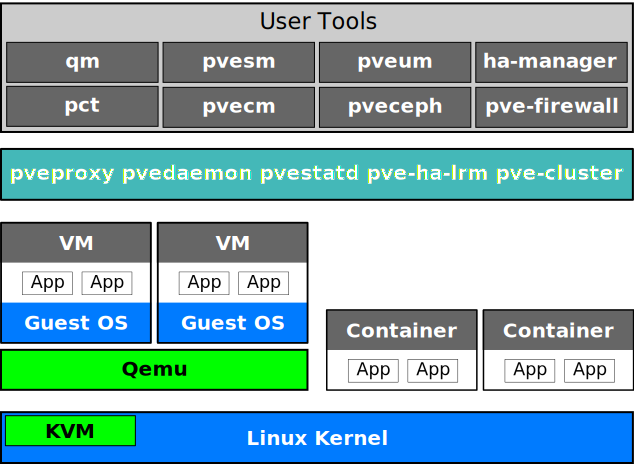

Introduction
============

{pve} is a platform to run virtual machines and containers. It is
based on Debian Linux, and completely open source. For maximum
flexibility, we implemented two virtualization technologies -
Kernel-based Virtual Machine (KVM) and container-based virtualization
(LXC).

One main design goal was to make administration as easy as
possible. You can use {pve} on a single node, or assemble a cluster of
many nodes. All management tasks can be done using our web-based
management interface, and even a novice user can setup and install
{pve} within minutes.

[[intro_central_management]]
Central Management
------------------

While many people start with a single node, {pve} can scale out to a
large set of clustered nodes. The cluster stack is fully integrated
and ships with the default installation.

Unique Multi-Master Design::

The integrated web-based management interface gives you a clean
overview of all your KVM guests and Linux containers and even of your
whole cluster. You can easily manage your VMs and containers, storage
or cluster from the GUI. There is no need to install a separate,
complex, and pricey management server.

Proxmox Cluster File System (pmxcfs)::

{pve} uses the unique Proxmox Cluster file system (pmxcfs), a
database-driven file system for storing configuration files. This
enables you to store the configuration of thousands of virtual
machines. By using corosync, these files are replicated in real time
on all cluster nodes. The file system stores all data inside a
persistent database on disk, nonetheless, a copy of the data resides
in RAM which provides a maximum storage size of 30MB - more than
enough for thousands of VMs.
+
{pve} is the only virtualization platform using this unique
cluster file system.

Web-based Management Interface::

{pve} is simple to use. Management tasks can be done via the
included web based management interface - there is no need to install a
separate management tool or any additional management node with huge
databases. The multi-master tool allows you to manage your whole
cluster from any node of your cluster. The central web-based
management - based on the JavaScript Framework (ExtJS) - empowers
you to control all functionalities from the GUI and overview history
and syslogs of each single node. This includes running backup or
restore jobs, live-migration or HA triggered activities.

Command Line::

For advanced users who are used to the comfort of the Unix shell or
Windows Powershell, {pve} provides a command-line interface to
manage all the components of your virtual environment. This command-line
interface has intelligent tab completion and full documentation
in the form of UNIX man pages.

REST API::

{pve} uses a RESTful API. We choose JSON as primary data format,
and the whole API is formally defined using JSON Schema. This enables
fast and easy integration for third party management tools like custom
hosting environments.

Role-based Administration::

You can define granular access for all objects (like VMs, storages,
nodes, etc.) by using the role based user- and permission
management. This allows you to define privileges and helps you to
control access to objects. This concept is also known as access
control lists: Each permission specifies a subject (a user or group)
and a role (set of privileges) on a specific path.

Authentication Realms::

{pve} supports multiple authentication sources like Microsoft
Active Directory, LDAP, Linux PAM standard authentication or the
built-in {pve} authentication server.

Flexible Storage
----------------

The {pve} storage model is very flexible. Virtual machine images
can either be stored on one or several local storages or on shared
storage like NFS and on SAN. There are no limits, you may configure as
many storage definitions as you like. You can use all storage
technologies available for Debian Linux.

One major benefit of storing VMs on shared storage is the ability to
live-migrate running machines without any downtime, as all nodes in
the cluster have direct access to VM disk images.

We currently support the following Network storage types:

* LVM Group (network backing with iSCSI targets)
* iSCSI target
* NFS Share
* CIFS Share
* Ceph RBD
* Directly use iSCSI LUNs
* GlusterFS

Local storage types supported are:

* LVM Group (local backing devices like block devices, FC devices, DRBD, etc.)
* Directory (storage on existing filesystem)
* ZFS

Integrated Backup and Restore
-----------------------------

The integrated backup tool (`vzdump`) creates consistent snapshots of
running Containers and KVM guests. It basically creates an archive of
the VM or CT data which includes the VM/CT configuration files.

KVM live backup works for all storage types including VM images on
NFS, CIFS, iSCSI LUN, Ceph RBD. The new backup format is optimized for storing
VM backups fast and effective (sparse files, out of order data, minimized I/O).

High Availability Cluster
-------------------------

A multi-node {pve} HA Cluster enables the definition of highly
available virtual servers. The {pve} HA Cluster is based on
proven Linux HA technologies, providing stable and reliable HA
services.

Flexible Networking
-------------------

{pve} uses a bridged networking model. All VMs can share one
bridge as if virtual network cables from each guest were all plugged
into the same switch. For connecting VMs to the outside world, bridges
are attached to physical network cards and assigned a TCP/IP
configuration.

For further flexibility, VLANs (IEEE 802.1q) and network
bonding/aggregation are possible. In this way it is possible to build
complex, flexible virtual networks for the {pve} hosts,
leveraging the full power of the Linux network stack.

Integrated Firewall
-------------------

The integrated firewall allows you to filter network packets on
any VM or Container interface. Common sets of firewall rules can
be grouped into ``security groups''.

include::hyper-converged-infrastructure.adoc[]

Why Open Source
---------------

{pve} uses a Linux kernel and is based on the Debian GNU/Linux
Distribution. The source code of {pve} is released under the
https://www.gnu.org/licenses/agpl-3.0.html[GNU Affero General Public
License, version 3]. This means that you are free to inspect the
source code at any time or contribute to the project yourself.

At Proxmox we are committed to use open source software whenever
possible. Using open source software guarantees full access to all
functionalities - as well as high security and reliability. We think
that everybody should have the right to access the source code of a
software to run it, build on it, or submit changes back to the
project. Everybody is encouraged to contribute while Proxmox ensures
the product always meets professional quality criteria.

Open source software also helps to keep your costs low and makes your
core infrastructure independent from a single vendor.

Your benefits with {pve}
------------------------

* Open source software
* No vendor lock-in
* Linux kernel
* Fast installation and easy-to-use
* Web-based management interface
* REST API
* Huge active community
* Low administration costs and simple deployment

include::getting-help.adoc[]

[[intro_project_history]]
Project History
---------------

The project started in 2007, followed by a first stable version in 2008. At the
time we used OpenVZ for containers, and QEMU with KVM for virtual machines. The
clustering features were limited, and the user interface was simple (server
generated web page).

But we quickly developed new features using the
https://corosync.github.io/corosync/[Corosync] cluster stack, and the
introduction of the new Proxmox cluster file system (pmxcfs) was a big step
forward, because it completely hides the cluster complexity from the user.
Managing a cluster of 16 nodes is as simple as managing a single node.

The introduction of our new REST API, with a complete declarative specification
written in JSON-Schema, enabled other people to integrate {pve} into their
infrastructure, and made it easy to provide additional services.

Also, the new REST API made it possible to replace the original user interface
with a modern client side single-page application using JavaScript. We also
replaced the old Java based VNC console code with
https://kanaka.github.io/noVNC/[noVNC]. So you only need a web browser to manage
your VMs.

The support for various storage types is another big task. Notably, {pve} was
the first distribution to ship https://zfsonlinux.org/[ZFS on Linux] by default
in 2014. Another milestone was the ability to run and manage
https://ceph.com/[Ceph] storage on the hypervisor nodes. Such setups are
extremely cost effective.

When our project started we were among the first companies providing commercial
support for KVM. The KVM project itself continuously evolved, and is now a
widely used hypervisor. New features arrive with each release. We developed the
KVM live backup feature, which makes it possible to create snapshot backups on
any storage type.

The most notable change with version 4.0 was the move from OpenVZ to
https://linuxcontainers.org/[LXC]. Containers are now deeply integrated, and
they can use the same storage and network features as virtual machines. At the
same time we introduced the easy-to-use xref:chapter_ha_manager[High
Availability (HA) manager], simplifying the configuration and management of
highly available setups.

During the development of {pve} 5 the asynchronous
xref:chapter_pvesr[storage replication] as well as automated
xref:sysadmin_certificate_management[certificate management] using ACME/Let's
Encrypt were introduced, among many other features.

The xref:chapter_pvesdn[Software Defined Network (SDN)] stack was developed in
cooperation with our community. It was integrated into the web interface as
an experimental feature in version 6.2, simplifying the management of
sophisticated network configurations. Since version 8.1, the SDN integration is
fully supported and installed by default.

2020 marked the release of a new project, the
https://www.proxmox.com/en/products/proxmox-backup-server/overview[Proxmox
Backup Server], written in the Rust programming language. Proxmox Backup Server
is deeply integrated with {pve} and significantly improves backup capabilities
by implementing incremental backups, deduplication, and much more.

Another new tool, the https://pom.proxmox.com[Proxmox
Offline Mirror], was released in 2022, enabling subscriptions for systems which
have no connection to the public internet.

The highly requested dark theme for the web interface was introduced in 2023.
Later that year, version 8.0 integrated access to the Ceph enterprise
repository. Now access to the most stable Ceph repository comes with any
{pve} subscription.

Automated and unattended installation for the official
xref:installation_installer[ISO installer] was introduced in version 8.2,
significantly simplifying large deployments of {pve}.

With the xref:qm_import_virtual_machines[import wizard], equally introduced in
version 8.2, users can easily and efficiently migrate guests directly from other
hypervisors like VMware ESXi footnote:[Migrate to Proxmox VE
https://pve.proxmox.com/wiki/Migrate_to_Proxmox_VE].
Additionally, archives in Open Virtualization Format (OVF/OVA) can now be
directly imported from file-based storages in the web interface.

include::howto-improve-pve-docs.adoc[]
include::translation.adoc[]

