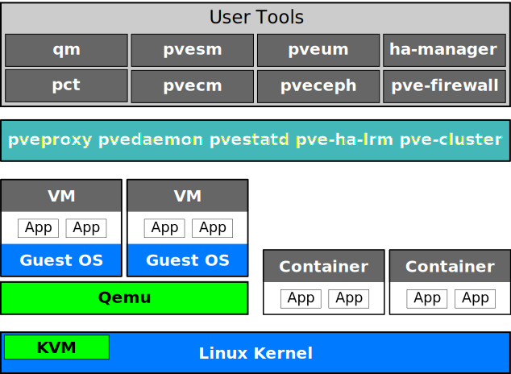

[[chapter_introduction]]
Introduction
============
ifndef::manvolnum[]
:pve-toplevel:
endif::manvolnum[]

{pve} is a platform for running virtual machines and containers. It is
based on Debian GNU/Linux and completely open source. For maximum
flexibility, {pve} provides two virtualization technologies—Kernel-based
Virtual Machine (KVM) and Linux Containers (LXC).

A core design goal is to make administration as easy as possible. You
can use {pve} on a single node, or assemble a cluster of many nodes.
All management tasks can be done through the web-based management
interface, and even a novice user can set up and install {pve} within
minutes.

[[intro_central_management]]
Central Management
------------------

While many people start with a single node, {pve} can scale out to a
large set of clustered nodes. The cluster stack is fully integrated
and ships with the default installation.

Unique Multi-Master Design::

Every node in a {pve} cluster can perform all management tasks. There
is no single-point-of-failure central management server—any node can
manage the entire cluster. This multi-master architecture keeps the
cluster manageable even if individual nodes are temporarily
unavailable.

Proxmox Cluster File System (pmxcfs)::

{pve} uses the Proxmox Cluster File System (pmxcfs), a
database-driven file system for storing configuration files. It can
store the configuration of thousands of virtual machines. Corosync
replicates these files in real time to all cluster nodes. The file
system stores all data inside a persistent database on disk, while a
copy resides in RAM, providing a maximum storage size of 30 MB—more
than enough for thousands of VMs.
+
{pve} is the only virtualization platform using this cluster file
system.

Web-based Management Interface::

{pve} is simple to use. The included web-based interface, built on
the ExtJS JavaScript framework, provides a clean overview of all KVM
guests and Linux containers, and full control over all cluster
resources. You can manage VMs, containers, storage, and networking
from the GUI, including history and syslog viewing for each node,
running backup or restore jobs, live migration, and HA-triggered
activities. There is no need to install a separate management tool or
additional management node.

Command Line::

For advanced users who prefer the comfort of a Unix shell or Windows
PowerShell, {pve} provides a command-line interface to manage all
components of the virtual environment. This command-line interface
has intelligent tab completion and full documentation in the form of
man pages.

REST API::

{pve} uses a RESTful API with JSON as the primary data format. The
entire API is formally defined using JSON Schema, enabling fast and
easy integration for third-party management tools such as custom
hosting environments.

Role-based Administration::

You can define granular access for all objects (such as VMs, storage,
and nodes) by using role-based user and permission management. Each
permission specifies a subject (a user or group) and a role (set of
privileges) on a specific path, following the access control list
model.

Authentication Realms::

{pve} supports multiple authentication sources, including Microsoft
Active Directory, LDAP, Linux PAM standard authentication, and the
built-in {pve} authentication server.

Flexible Storage
----------------

The {pve} storage model is very flexible. Virtual machine images can
be stored on one or several local storages, or on shared storage such
as NFS or SAN. You may configure as many storage definitions as you
like, using all storage technologies available for Debian GNU/Linux.

One major benefit of storing VMs on shared storage is the ability to
live-migrate running machines without any downtime, as all nodes in
the cluster have direct access to VM disk images.

The following network storage types are supported:

* LVM group (network backing with iSCSI targets)
* iSCSI target
* iSCSI LUNs (direct use)
* NFS share
* CIFS share
* Ceph RBD
* CephFS
* Proxmox Backup Server

The following local storage types are supported:

* LVM group (local backing devices such as block devices, Fibre Channel
  devices, and DRBD)
* Directory (storage on existing file system)
* ZFS

Integrated Backup and Restore
-----------------------------

The integrated backup tool (`vzdump`) creates consistent snapshots of
running containers and KVM guests. It creates an archive of the VM or
container data, including the configuration files.

Additionally, the xref:storage_pbs[Proxmox Backup Server integration]
provides advanced features, including the ability to combine full backups
and data deduplication, perform client-side encryption, back up to tape
or S3 object storage, and sync with other offsite Proxmox Backup Server
installations.

KVM live backup works for all storage types including VM images on NFS,
CIFS, iSCSI LUN, and Ceph RBD. The backup format is optimized for
storing VM backups efficiently—using sparse files, out-of-order data, and
minimized I/O.

High Availability Cluster
-------------------------

A multi-node {pve} HA cluster enables highly available virtual machines
and containers. The integrated
xref:chapter_ha_manager[High Availability (HA) manager] automatically
detects node failures using watchdog-based fencing and restarts affected
services on healthy nodes. No external tools like Pacemaker are needed—the
HA stack ships with {pve} and is configured entirely through the web
interface or command line.

Flexible Networking
-------------------

{pve} uses a bridged networking model. All VMs can share one bridge
as if virtual network cables from each guest were all plugged into
the same switch. For connecting VMs to the outside world, bridges are
attached to physical network cards and assigned a TCP/IP
configuration.

For further flexibility, Virtual LANs (VLANs, IEEE 802.1q) and
network bonding/aggregation are available, allowing you to build
complex, flexible virtual networks for the {pve} hosts and leverage
the full power of the Linux network stack.

For larger or multi-tenant environments, the
xref:chapter_pvesdn[Software Defined Network (SDN)] stack provides
zone-based network isolation and supports protocols such as VXLAN and
EVPN. SDN is fully integrated into the web interface and installed by
default.

Integrated Firewall
-------------------

The integrated firewall allows you to filter network packets on
any VM or container interface. Common sets of firewall rules can
be grouped into ``security groups''.

include::hyper-converged-infrastructure.adoc[]

Why Open Source
---------------

{pve} uses a Linux kernel and is based on the Debian GNU/Linux
distribution. The source code of {pve} is released under the
https://www.gnu.org/licenses/agpl-3.0.html[GNU Affero General Public
License, version 3]. This means that you are free to inspect the
source code at any time or contribute to the project yourself.

Proxmox is committed to using open source software whenever possible.
Open source software guarantees full access to all functionality—as
well as high security and reliability. Everybody should have the right
to access the source code of software to run it, build on it, or
submit changes back to the project. Everybody is encouraged to
contribute while Proxmox ensures the product always meets professional
quality criteria.

Open source software also helps to keep costs low and makes core
infrastructure independent from a single vendor.

Your Benefits with {pve}
------------------------

* Open source software
* No vendor lock-in
* Linux kernel
* Fast installation and easy to use
* Web-based management interface
* REST API
* Huge active community
* Low administration costs and simple deployment

include::getting-help.adoc[]

[[intro_project_history]]
Project History
---------------

The project started in 2007, followed by a first stable version in 2008.
At the time, it used OpenVZ for containers and KVM for virtual machines.
The clustering features were limited, and the user interface was simple
(a server-generated web page).

The project quickly developed new features using the
https://corosync.github.io/corosync/[Corosync] cluster stack, and the
introduction of the Proxmox Cluster File System (pmxcfs) was a big step
forward, because it completely hides the cluster complexity from the
user. Managing a cluster of 16 nodes is as simple as managing a single
node.

The introduction of the REST API, with a complete declarative
specification written in JSON Schema, enabled other people to integrate
{pve} into their infrastructure and made it easy to provide additional
services.

The REST API also made it possible to replace the original user interface
with a modern client-side single-page application using JavaScript. The
old Java-based VNC console code was replaced with
https://novnc.com/info.html[noVNC], so only a web browser is needed to
manage VMs.

The support for various storage types is another big achievement.
Notably, {pve} was the first distribution to ship
https://zfsonlinux.org/[ZFS on Linux] by default in 2014. Another
milestone was the ability to run and manage
https://ceph.com/[Ceph] storage on the hypervisor nodes. Such setups are
extremely cost effective.

When the project started, Proxmox was among the first companies
providing commercial support for KVM. The KVM project itself continuously
evolved and is now a widely used hypervisor. New features arrive with
each release. The KVM live backup feature, developed by Proxmox, makes
it possible to create snapshot backups on any storage type.

The most notable change with version 4.0 was the move from OpenVZ to
https://linuxcontainers.org/[LXC]. Containers are now deeply integrated,
and they can use the same storage and network features as virtual
machines. At the same time, the easy-to-use
xref:chapter_ha_manager[High Availability (HA) manager] was introduced,
simplifying the configuration and management of highly available setups.

During the development of {pve} 5, asynchronous
xref:chapter_pvesr[storage replication] as well as automated
xref:sysadmin_certificate_management[certificate management] using
ACME/Let's Encrypt were introduced, among many other features.

The xref:chapter_pvesdn[Software Defined Network (SDN)] stack was
developed in cooperation with the community. It was integrated into the
web interface as an experimental feature in version 6.2, simplifying the
management of sophisticated network configurations. Since version 8.1,
the SDN integration is fully supported and installed by default.

2020 marked the release of a new project, the
https://www.proxmox.com/en/products/proxmox-backup-server/overview[Proxmox
Backup Server], written in the Rust programming language. Proxmox Backup
Server is deeply integrated with {pve} and significantly improves backup
capabilities by implementing incremental backups, deduplication, and much
more.

Another new tool, the https://pom.proxmox.com[Proxmox
Offline Mirror], was released in 2022, enabling subscriptions for systems
which have no connection to the public internet.

The highly requested dark theme for the web interface was introduced in
2023. Later that year, version 8.0 integrated access to the Ceph
enterprise repository. Access to the most stable Ceph repository is
included with any {pve} subscription.

Automated and unattended installation for the official
xref:installation_installer[ISO installer] was introduced in version 8.2,
significantly simplifying large deployments of {pve}.

With the xref:qm_import_virtual_machines[import wizard], equally
introduced in version 8.2, users can easily and efficiently migrate
guests directly from other hypervisors like VMware ESXi
footnote:[Migrate to Proxmox VE
https://pve.proxmox.com/wiki/Migrate_to_Proxmox_VE].
Additionally, archives in Open Virtualization Format (OVF/OVA) can now be
directly imported from file-based storages in the web interface.

include::howto-improve-pve-docs.adoc[]
include::translation.adoc[]

