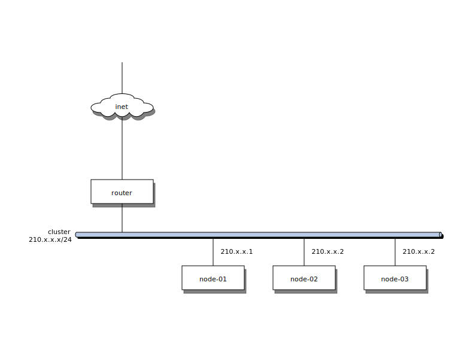
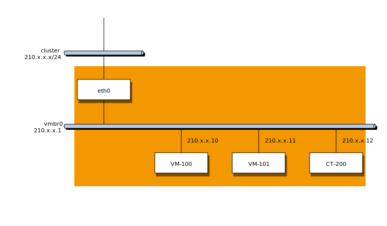

Host System Administration
==========================

{pve} is based on the famous https://www.debian.org/[Debian] Linux
distribution. That means that you have access to the whole world of
Debian packages, and the base system is well documented. The
https://debian-handbook.info/download/stable/debian-handbook.pdf[Debian
Administrator\'s Handbook] is available online, and provide a
comprehensive introduction to the Debian operating system (see
xref:Hertzog13[]).

A standard {pve} installation uses the default repositories from
Debian, so you get bug fixes and security updates through that
channel. In addition, we provide our own package repository to roll
out all {pve} related packages. This includes updates to some
Debian packages when necessary.

We also deliver a specially optimized Linux kernel, where we enable all
required virtualization and container features. That kernel includes
drivers for http://zfsonlinux.org/[ZFS], and several hardware drivers.
For example, we ship Intel network card drivers to support their
newest hardware.

The following sections will concentrate on virtualization related
topics. They either explains things which are different on {pve}, or
tasks which are commonly used on {pve}. For other topics, please refer
to the standard Debian documentation.

System requirements
-------------------

For production servers, high quality server equipment is needed. Keep
in mind, if you run 10 Virtual Servers on one machine and you then
experience a hardware failure, 10 services are lost. {pve}
supports clustering, this means that multiple {pve} installations
can be centrally managed thanks to the included cluster functionality.

{pve} can use local storage (DAS), SAN, NAS and also distributed
storage (Ceph RBD). For details see xref:chapter-storage[chapter storage].

Minimum requirements, for evaluation
~~~~~~~~~~~~~~~~~~~~~~~~~~~~~~~~~~~~

* CPU: 64bit (Intel EMT64 or AMD64)

* RAM: 1 GB RAM

* Hard drive

* One NIC

Recommended system requirements
~~~~~~~~~~~~~~~~~~~~~~~~~~~~~~~

* CPU: 64bit (Intel EMT64 or AMD64), Multi core CPU recommended

* RAM: 8 GB is good, more is better

* Hardware RAID with batteries protected write cache (BBU) or flash
 based protection

* Fast hard drives, best results with 15k rpm SAS, Raid10

* At least two NIC´s, depending on the used storage technology you need more

Getting Help
------------

There are basically two different support channels. {pve} itself if
fully open source, so we always encourage our users to discuss and
share their knowledge using the http://forum.proxmox.com/[Community
Support Forum]. The forum is fully moderated by the Proxmox support
team. Up to now, the forum has about 25.000 members, and more than
120.000 messages. Needless to say that such a large forum is a great
place to get information.

The second channel is the commercial support provided by
{proxmoxGmbh}. {pve} server subscriptions can be ordered online, see
http://shop.maurer-it.com[{pve} Shop]. For all details see
http://www.proxmox.com/proxmox-ve/pricing[{pve} Subscription Service
Plans].

Please contact the mailto:office@proxmox.com[Proxmox sales team] for
commercial support requests or volume discounts.

Package Repositories
--------------------

All Debian based systems use
http://en.wikipedia.org/wiki/Advanced_Packaging_Tool[APT] as package
management tool. The list of repositories is defined in
'/etc/apt/sources.list' and '.list' files found inside
'/etc/apt/sources.d/'. Updates can be installed directly using
'apt-get', or via the GUI.

Apt 'sources.list' files lists one package repository per line, with
the most preferred source listed first. Empty lines are ignored, and a
'#' character anywhere on a line marks the remainder of that line as a
comment. The information available from the configured sources is
acquired by 'apt-get update'.

.File '/etc/apt/sources.list'
----
deb http://ftp.debian.org/debian jessie main contrib

# security updates
deb http://security.debian.org jessie/updates main contrib
----

In addition, {pve} provides three different package repositories.

{pve} Enterprise Repository
~~~~~~~~~~~~~~~~~~~~~~~~~~~

This is the default, stable and recommended repository, available for
all {pve} subscription users. It contains the most stable packages,
and is suitable for production use. You need a valid subscription key
to access this repository. The `pve-enterprise` repository is enabled
by default:

.File '/etc/apt/sources.list.d/pve-enterprise.list'
----
deb https://enterprise.proxmox.com/debian jessie pve-enterprise
----

NOTE: You can disable this repository by commenting out the above line
using a '#' (at the start of the line). This prevents error messages
if you do not have a subscription key. Please configure the
`pve-no-subscription` repository in that case.

As soon as updates are available, the `root@pam` user is notified via
email about the available new packages. On the GUI, the change-log of
each package can be viewed (if available), showing all details of the
update. So you will never miss important security fixes.

{pve} No-Subscription Repository
~~~~~~~~~~~~~~~~~~~~~~~~~~~~~~~~

As the name suggests, you do not need a subscription key to access
this repository. It can be used for testing and non-production
use. Its not recommended to run on production servers, as these
packages are not always heavily tested and validated.

We recommend to configure this repository in '/etc/apt/sources.list'.

.File '/etc/apt/sources.list'
----
deb http://ftp.debian.org/debian jessie main contrib

# PVE pve-no-subscription repository provided by proxmox.com,
# NOT recommended for production use
deb http://download.proxmox.com/debian jessie pve-no-subscription

# security updates
deb http://security.debian.org jessie/updates main contrib
----

 
{pve} Test Repository
~~~~~~~~~~~~~~~~~~~~~~

Finally, there is a repository called `pvetest`. This one contains the
latest packages and is heavily used by developers to test new
features. As usual, you can configure this using
'/etc/apt/sources.list' by adding the following line:

.sources.list entry for `pvetest`
----
deb http://download.proxmox.com/debian jessie pvetest
----

Installing {pve}
----------------

{pve} ships as a set of Debian packages, so you can simply install it
on top of a normal Debian installation. After configuring the
repositories, you need to run:

[source,bash]
----
apt-get update
apt-get install proxmox-ve
----

While this looks easy, it presumes that you have correctly installed
the base system, and you know how you want to configure and use the
local storage. Network configuration is also completely up to you.

In general, this is not trivial, especially when you use LVM or
ZFS. This is why we provide an installation CDROM for {pve}. That
installer just ask you a few questions, then partitions the local
disk(s), installs all required packages, and configures the system
including a basic network setup. You can get a fully functional system
within a few minutes, including the following:

* Complete operating system (Debian Linux, 64-bit)
* Partition the hard drive with ext4 (alternative ext3 or xfs) or ZFS
* {pve} Kernel with LXC and KVM support
* Complete toolset
* Web based management interface

NOTE: By default, the complete server is used and all existing data is
removed.

Installation Options
~~~~~~~~~~~~~~~~~~~~

Please insert the installation CD-ROM, then boot from that
drive. Immediately afterwards you can choose the following menu
options:

Install Proxmox VE::

Start normal installation.

Install Proxmox VE (Debug mode)::

Start installation in debug mode. It opens a shell console at several
installation steps, so that you can debug things if something goes
wrong. Please press `CTRL-D` to exit those debug consoles and continue
installation. This option is mostly for developers and not meant for
general use.

Test Memory::

Runs 'memtest86+'. This is useful to check if your memory if
functional and error free.

You normally select *Install Proxmox VE* to start the installation. 

After that you get prompted to select the target hard disk(s). The
`Options` button beside lets you select the target file system, and
defaults to `ext4`.

If you have more than one disk, you can also select ZFS here. ZFS
supports several software RAID levels, so this is specially useful if
you do not have a hardware RAID controller.

The next pages just asks for basic configuration options like time
zone and keyboard layout. You also need to specify your email address
and select a superuser password.

The last step is the network configuration. Please note that you can
use either IPv4 or IPv6 here, but not both. If you want to configure a
dual stack node, you can easily do that after installation.

If you press `Next` now, installation starts to format disks, and
copies packages to the target. Please wait until that is finished,
then reboot the server.

Further configuration is done via the Proxmox web interface. Just
point your browser to the IP address given during installation
(https://youripaddress:8006). {pve} is tested for IE9, Firefox 10
and higher, Google Chrome (latest).

Network Configuration
---------------------

Basic network setup.

Local Storage
-------------

Logical Volume Manager (LVM)
~~~~~~~~~~~~~~~~~~~~~~~~~~~~

TODO: info about LVM.

ZFS on Linux
~~~~~~~~~~~~

TODO: info about ZFS.

Working with 'systemd'
----------------------

Journal and syslog
~~~~~~~~~~~~~~~~~~

TODO: explain persistent journal...

