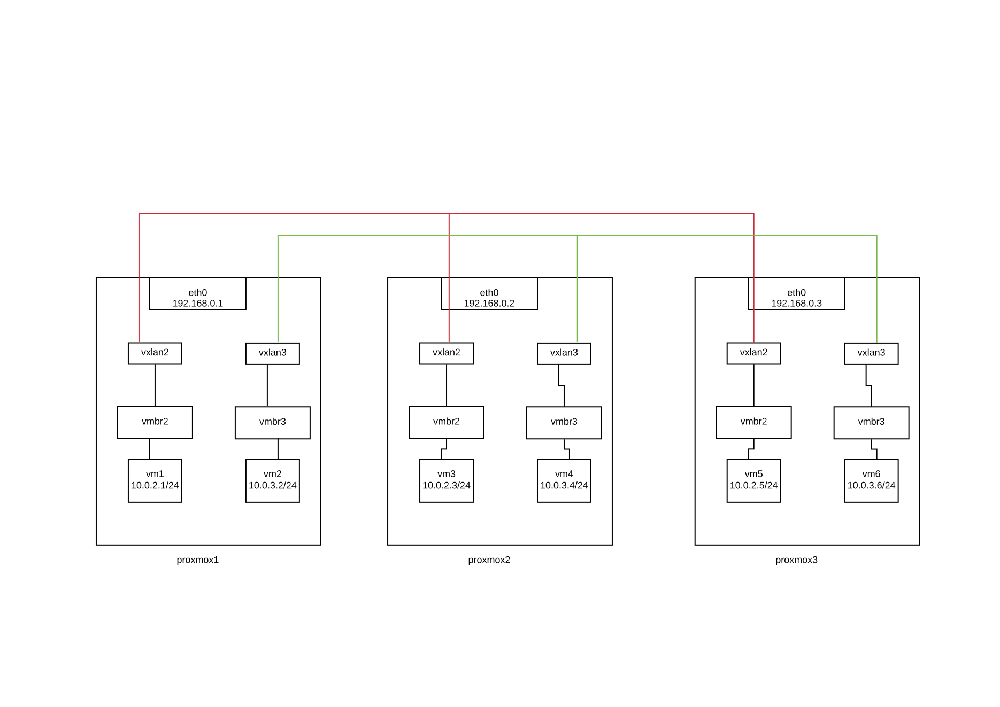
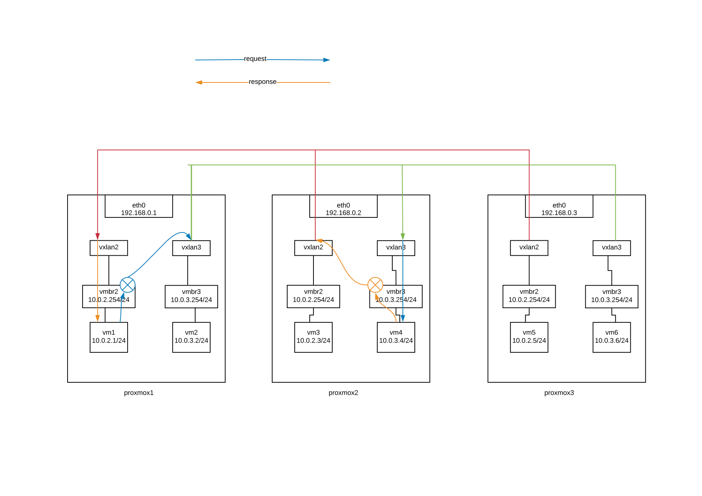
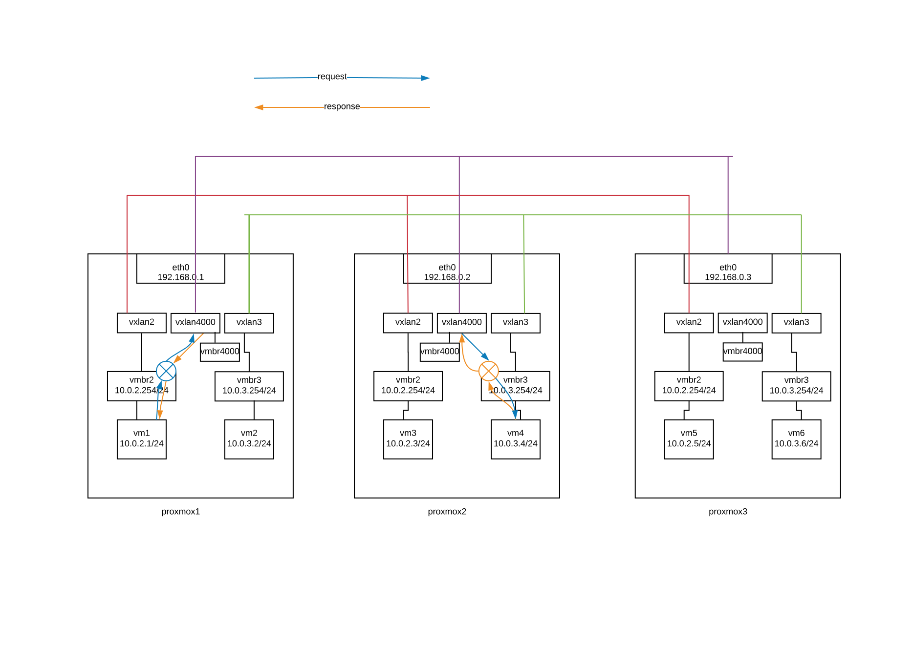

////

This is currently not included, because
- it requires ifupdown2
- routing needs more documentation

////

VXLAN layer2 with vlan unware linux bridges
~~~~~~~~~~~~~~~~~~~~~~~~~~~~~~~~~~~~~~~~~~~

VXLAN is an overlay network to carry Ethernet traffic over an existing IP network
while accommodating a very large number of tenants. It is defined in RFC 7348.
Each overlay network is known as a VXLAN Segment and identified by a unique
24-bit segment ID called a VXLAN Network Identifier (VNI).

For BUM traffic (broadcast / unknown unicast traffic, multicast),
we have 3 differents vxlan setup modes : multicast, unicast, bgp-evpn

multicast mode
^^^^^^^^^^^^^^

This scenario relies in head end replication, meaning that end host in case
of not having any entry for the destination MAC address will send out an ARP
to other devices / VTEPs in the VXLAN network.
This is done by sending the request to the VXLAN multicast group,
remote VTEPs will get the packet and answer accordingly direct to the originating VTEP.

* node1

----
auto eno1
iface eno1 inet manual

auto vmbr0
iface vmbr0 inet static
        address 192.168.0.1
        netmask  255.255.255.0
        bridge_ports eno1
        bridge_stp off
        bridge_fd 0

auto vxlan2
iface vxlan2 inet manual
        vxlan-svcnodeip 225.20.1.1
        vxlan-physdev eno1

auto vmbr2
iface vmbr2 inet manual
        bridge_ports vxlan2
        bridge_stp off
        bridge_fd 0

auto vxlan3
iface vxlan3 inet manual
        vxlan-svcnodeip 225.20.1.1
        vxlan-physdev eno1

auto vmbr3
iface vmbr3 inet manual
        bridge_ports vxlan3
        bridge_stp off
        bridge_fd 0
----

* node2

----
auto eno1
iface eno1 inet manual

auto vmbr0
iface vmbr0 inet static
        address 192.168.0.2
        netmask  255.255.255.0
        bridge_ports eno1
        bridge_stp off
        bridge_fd 0

auto vxlan2
iface vxlan2 inet manual
        vxlan-svcnodeip 225.20.1.1
        vxlan-physdev eno1

auto vmbr2
iface vmbr2 inet manual
        bridge_ports vxlan2
        bridge_stp off
        bridge_fd 0

auto vxlan3
iface vxlan3 inet manual
        vxlan-svcnodeip 225.20.1.1
        vxlan-physdev eno1

auto vmbr3
iface vmbr3 inet manual
        bridge_ports vxlan3
        bridge_stp off
        bridge_fd 0
----

* node3

----
auto eno1
iface eno1 inet manual

auto vmbr0
iface vmbr0 inet static
        address 192.168.0.3
        netmask  255.255.255.0
        bridge_ports eno1
        bridge_stp off
        bridge_fd 0

auto vxlan2
iface vxlan2 inet manual
        vxlan-svcnodeip 225.20.1.1
        vxlan-physdev eno1

auto vmbr2
iface vmbr2 inet manual
        bridge_ports vxlan2
        bridge_stp off
        bridge_fd 0

auto vxlan3
iface vxlan3 inet manual
        vxlan-svcnodeip 225.20.1.1
        vxlan-physdev eno1

auto vmbr3
iface vmbr3 inet manual
        bridge_ports vxlan3
        bridge_stp off
        bridge_fd 0
----

unicast mode
^^^^^^^^^^^^

We can replace multicast by head-end replication of BUM frames to a statically configured lists of remote VTEPs.
The VXLAN is defined without a remote multicast group.
Instead, all the remote VTEPs are associated with the all-zero address:
a BUM frame will be duplicated to all these destinations.
The VXLAN device will still learn remote addresses automatically using source-address learning.

* node1

----
auto eno1
iface eno1 inet manual

auto vmbr0
iface vmbr0 inet static
        address 192.168.0.1
        netmask  255.255.255.0
        bridge_ports eno1
        bridge_stp off
        bridge_fd 0

auto vxlan2
iface vxlan2 inet manual
        vxlan_remoteip 192.168.0.2
        vxlan_remoteip 192.168.0.3

auto vmbr2
iface vmbr2 inet manual
        bridge_ports vxlan2
        bridge_stp off
        bridge_fd 0

auto vxlan3
iface vxlan2 inet manual
        vxlan_remoteip 192.168.0.2
        vxlan_remoteip 192.168.0.3

auto vmbr3
iface vmbr3 inet manual
        bridge_ports vxlan3
        bridge_stp off
        bridge_fd 0
----

* node2

----
auto eno1
iface eno1 inet manual

auto vmbr0
iface vmbr0 inet static
        address 192.168.0.2
        netmask  255.255.255.0
        bridge_ports eno1
        bridge_stp off
        bridge_fd 0

auto vxlan2
iface vxlan2 inet manual
        vxlan_remoteip 192.168.0.1
        vxlan_remoteip 192.168.0.3

auto vmbr2
iface vmbr2 inet manual
        bridge_ports vxlan2
        bridge_stp off
        bridge_fd 0

auto vxlan3
iface vxlan2 inet manual
        vxlan_remoteip 192.168.0.1
        vxlan_remoteip 192.168.0.3

auto vmbr3
iface vmbr3 inet manual
        bridge_ports vxlan3
        bridge_stp off
        bridge_fd 0
----

* node3

----
auto eno1
iface eno1 inet manual

auto vmbr0
iface vmbr0 inet static
        address 192.168.0.3
        netmask  255.255.255.0
        bridge_ports eno1
        bridge_stp off
        bridge_fd 0

auto vxlan2
iface vxlan2 inet manual
        vxlan_remoteip 192.168.0.2
        vxlan_remoteip 192.168.0.3

auto vmbr2
iface vmbr2 inet manual
        bridge_ports vxlan2
        bridge_stp off
        bridge_fd 0

auto vxlan3
iface vxlan2 inet manual
        vxlan_remoteip 192.168.0.2
        vxlan_remoteip 192.168.0.3

auto vmbr3
iface vmbr3 inet manual
        bridge_ports vxlan3
        bridge_stp off
        bridge_fd 0
----

bgp-evpn
^^^^^^^^

VTEPs use control plane learning/distribution via BGP for remote MAC addresses instead of data plane learning.
VTEPs have the ability to suppress ARP flooding over VXLAN tunnels.

The control plane used here is FRR, a bgp routing software.
Each node in the proxmox cluster peer with each others nodes.
For bigger networks, or multiple proxmox clusters,
it's possible to use external bgp route reflector servers.

* node1

----
auto eno1
iface eno1 inet manual

auto vmbr0
iface vmbr0 inet static
        address 192.168.0.1
        netmask 255.255.255.0
        bridge_ports eno1
        bridge_stp off
        bridge_fd 0

auto vxlan2
iface vxlan2 inet manual
        vxlan-local-tunnelip 192.168.0.1
        bridge-learning off
        bridge-arp-nd-suppress on
        bridge-unicast-flood off
        bridge-multicast-flood off

auto vmbr2
iface vmbr2 inet manual
        bridge_ports vxlan2
        bridge_stp off
        bridge_fd 0

auto vxlan3
iface vxlan3 inet manual
        vxlan-local-tunnelip 192.168.0.1
        bridge-learning off
        bridge-arp-nd-suppress on
        bridge-unicast-flood off
        bridge-multicast-flood off

auto vmbr3
iface vmbr3 inet manual
        bridge_ports vxlan3
        bridge_stp off
        bridge_fd 0
----

/etc/frr/frr.conf

----
router bgp 1234
 no bgp default ipv4-unicast
 coalesce-time 1000
 neighbor 192.168.0.2 remote-as 1234
 neighbor 192.168.0.3 remote-as 1234
 !
 address-family l2vpn evpn
  neighbor 192.168.0.2 activate
  neighbor 192.168.0.3 activate
  advertise-all-vni
 exit-address-family
!
line vty
!
----

* node2

----
auto eno1
iface eno1 inet manual

auto vmbr0
iface vmbr0 inet static
        address 192.168.0.2
        netmask 255.255.255.0
        bridge_ports eno1
        bridge_stp off
        bridge_fd 0

auto vxlan2
iface vxlan2 inet manual
        vxlan-local-tunnelip 192.168.0.2
        bridge-learning off
        bridge-arp-nd-suppress on
        bridge-unicast-flood off
        bridge-multicast-flood off

auto vmbr2
iface vmbr2 inet manual
        bridge_ports vxlan2
        bridge_stp off
        bridge_fd 0

auto vxlan3
iface vxlan3 inet manual
        vxlan-local-tunnelip 192.168.0.2
        bridge-learning off
        bridge-arp-nd-suppress on
        bridge-unicast-flood off
        bridge-multicast-flood off

auto vmbr3
iface vmbr3 inet manual
        bridge_ports vxlan3
        bridge_stp off
        bridge_fd 0
----

/etc/frr/frr.conf

----
router bgp 1234
 no bgp default ipv4-unicast
 coalesce-time 1000
 neighbor 192.168.0.1 remote-as 1234
 neighbor 192.168.0.3 remote-as 1234
 !
 address-family l2vpn evpn
  neighbor 192.168.0.1 activate
  neighbor 192.168.0.3 activate
  advertise-all-vni
 exit-address-family
!
line vty
!
----

* node3

----
auto eno1
iface eno1 inet manual

auto vmbr0
iface vmbr0 inet static
        address 192.168.0.2
        netmask 255.255.255.0
        bridge_ports eno1
        bridge_stp off
        bridge_fd 0

auto vxlan2
iface vxlan2 inet manual
        vxlan-local-tunnelip 192.168.0.3
        bridge-learning off
        bridge-arp-nd-suppress on
        bridge-unicast-flood off
        bridge-multicast-flood off

auto vmbr2
iface vmbr2 inet manual
        bridge_ports vxlan2
        bridge_stp off
        bridge_fd 0

auto vxlan3
iface vxlan3 inet manual
        vxlan-local-tunnelip 192.168.0.3
        bridge-learning off
        bridge-arp-nd-suppress on
        bridge-unicast-flood off
        bridge-multicast-flood off

auto vmbr3
iface vmbr3 inet manual
        bridge_ports vxlan3
        bridge_stp off
        bridge_fd 0
----

/etc/frr/frr.conf

----
router bgp 1234
 no bgp default ipv4-unicast
 coalesce-time 1000
 neighbor 192.168.0.1 remote-as 1234
 neighbor 192.168.0.2 remote-as 1234
 !
 address-family l2vpn evpn
  neighbor 192.168.0.1 activate
  neighbor 192.168.0.2 activate
  advertise-all-vni
 exit-address-family
!
line vty
!
----

VXLAN layer3 routing with anycast gateway
~~~~~~~~~~~~~~~~~~~~~~~~~~~~~~~~~~~~~~~~~

With this need, each vmbr bridge will be the gateway for the vm.
Same vmbr on different node, will have same ip address and same mac address,
to have working vm live migration and no network disruption.

VXLAN layer3 routing only work with FRR and non-aware bridge. 
(vlan aware bridge support is buggy currently).

asymmetric model
^^^^^^^^^^^^^^^^

This is the simplest mode. To get it work, all vxlan need to be defined on all nodes.

The asymmetric model allows routing and bridging on the VXLAN tunnel ingress, 
but only bridging on the egress. 
This results in bi-directional VXLAN traffic traveling on different VNIs 
in each direction (always the destination VNI) across the routed infrastructure.

sysctl.conf tuning

----
#enable routing
net.ipv4.ip_forward=1
net.ipv6.conf.all.forwarding=1
----

* node1

----
auto eno1
iface eno1 inet manual
 
auto vmbr0
iface vmbr0 inet static
         address 192.168.0.1
         netmask  255.255.255.0
         bridge_ports eno1
         bridge_stp off
         bridge_fd 0
 
auto vxlan2
iface vxlan2 inet manual
        vxlan-local-tunnelip 192.168.0.1
        bridge-learning off
        bridge-arp-nd-suppress on
        bridge-unicast-flood off
        bridge-multicast-flood off

auto vmbr2
iface vmbr2 inet static
        address 10.0.2.254
        netmask 255.255.255.0
        hwaddress 44:39:39:FF:40:94
        bridge_ports vxlan2
        bridge_stp off
        bridge_fd 0

auto vxlan3
iface vxlan3 inet manual
        vxlan-local-tunnelip 192.168.0.1
        bridge-learning off
        bridge-arp-nd-suppress on
        bridge-unicast-flood off
        bridge-multicast-flood off

auto vmbr3
iface vmbr3 inet static
        address 10.0.3.254
        netmask 255.255.255.0
        hwaddress 44:39:39:FF:40:94
        bridge_ports vxlan3
        bridge_stp off
        bridge_fd 0
----

frr.conf

----
router bgp 1234
 bgp router-id 192.168.0.1
 no bgp default ipv4-unicast
 coalesce-time 1000
 neighbor 192.168.0.2 remote-as 1234
 neighbor 192.168.0.3 remote-as 1234
 !
 address-family l2vpn evpn
  neighbor 192.168.0.2 activate
  neighbor 192.168.0.3 activate
  advertise-all-vni	
 exit-address-family
!
line vty
!
----

* node2

----
auto eno1
iface eno1 inet manual
 
auto vmbr0
iface vmbr0 inet static
         address 192.168.0.2
         netmask  255.255.255.0
         bridge_ports eno1
         bridge_stp off
         bridge_fd 0
 
auto vxlan2
iface vxlan2 inet manual
        vxlan-local-tunnelip 192.168.0.2
        bridge-learning off
        bridge-arp-nd-suppress on
        bridge-unicast-flood off
        bridge-multicast-flood off

auto vmbr2
iface vmbr2 inet static
        address 10.0.2.254
        netmask 255.255.255.0
        hwaddress 44:39:39:FF:40:94
        bridge_ports vxlan2
        bridge_stp off
        bridge_fd 0

auto vxlan3
iface vxlan3 inet manual
        vxlan-local-tunnelip 192.168.0.2
        bridge-learning off
        bridge-arp-nd-suppress on
        bridge-unicast-flood off
        bridge-multicast-flood off

auto vmbr3
iface vmbr3 inet static
        address 10.0.3.254
        netmask 255.255.255.0
        hwaddress 44:39:39:FF:40:94
        bridge_ports vxlan3
        bridge_stp off
        bridge_fd 0
----

frr.conf

----
router bgp 1234
 bgp router-id 192.168.0.2
 no bgp default ipv4-unicast
 coalesce-time 1000
 neighbor 192.168.0.1 remote-as 1234
 neighbor 192.168.0.3 remote-as 1234
 !
 address-family l2vpn evpn
  neighbor 192.168.0.1 activate
  neighbor 192.168.0.3 activate
  advertise-all-vni	
 exit-address-family
!
line vty
!
----

* node3

----
auto eno1
iface eno1 inet manual
 
auto vmbr0
iface vmbr0 inet static
         address 192.168.0.3
         netmask  255.255.255.0
         bridge_ports eno1
         bridge_stp off
         bridge_fd 0
 
auto vxlan2
iface vxlan2 inet manual
        vxlan-local-tunnelip 192.168.0.3
        bridge-learning off
        bridge-arp-nd-suppress on
        bridge-unicast-flood off
        bridge-multicast-flood off

auto vmbr2
iface vmbr2 inet static
        address 10.0.2.254
        netmask 255.255.255.0
        hwaddress 44:39:39:FF:40:94
        bridge_ports vxlan2
        bridge_stp off
        bridge_fd 0

auto vxlan3
iface vxlan3 inet manual
        vxlan-local-tunnelip 192.168.0.3
        bridge-learning off
        bridge-arp-nd-suppress on
        bridge-unicast-flood off
        bridge-multicast-flood off

auto vmbr3
iface vmbr3 inet static
        address 10.0.3.254
        netmask 255.255.255.0
        hwaddress 44:39:39:FF:40:94
        bridge_ports vxlan3
        bridge_stp off
        bridge_fd 0
----

frr.conf

----
router bgp 1234
 bgp router-id 192.168.0.3
 no bgp default ipv4-unicast
 coalesce-time 1000
 neighbor 192.168.0.1 remote-as 1234
 neighbor 192.168.0.2 remote-as 1234
 !
 address-family l2vpn evpn
  neighbor 192.168.0.1 activate
  neighbor 192.168.0.2 activate
  advertise-all-vni	
 exit-address-family
!
line vty
!
----

symmetric model
^^^^^^^^^^^^^^^

With this model, you don't need to have all vxlan on all nodes.
This model will also be needed to route traffic to an external router. 

The symmetric model routes and bridges on both the ingress and the egress leafs. 
This results in bi-directional traffic being able to travel on the same VNI, hence the symmetric name. 
However, a new specialty transit VNI is used for all routed VXLAN traffic, called the L3VNI. 
All traffic that needs to be routed will be routed onto the L3VNI, tunneled across the layer 3 Infrastructure, 
routed off the L3VNI to the appropriate VLAN and ultimately bridged to the destination.

A vrf is needed for the L3VNI, so all vmbr bridge need to be in the vrf if they want to be able to reach each others.

sysctl.conf tuning

----
#enable routing
net.ipv4.ip_forward=1
net.ipv6.conf.all.forwarding=1
#disable reverse path filtering
net.ipv4.conf.default.rp_filter=0
net.ipv4.conf.all.rp_filter=0
----

* node1

----
auto vrf1
iface vrf1
    vrf-table auto

auto eno1
iface eno1 inet manual
 
auto vmbr0
iface vmbr0 inet static
         address 192.168.0.1
         netmask  255.255.255.0
         bridge_ports eno1
         bridge_stp off
         bridge_fd 0

auto vxlan2
iface vxlan2 inet manual
        vxlan-local-tunnelip 192.168.0.1
        bridge-learning off
        bridge-arp-nd-suppress on
        bridge-unicast-flood off
        bridge-multicast-flood off

auto vmbr2
iface vmbr2 inet static
        bridge_ports vxlan2
        bridge_stp off
        bridge_fd 0
        address 10.0.2.254
        netmask 255.255.255.0
        hwaddress 44:39:39:FF:40:94 #must be same on each node vmbr2
        vrf vrf1

auto vxlan3
iface vxlan3 inet manual
        vxlan-local-tunnelip 192.168.0.1
        bridge-learning off
        bridge-arp-nd-suppress on
        bridge-unicast-flood off
        bridge-multicast-flood off

auto vmbr3
iface vmbr3 inet static
        bridge_ports vxlan3
        bridge_stp off
        bridge_fd 0
        address 10.0.3.254
        netmask 255.255.255.0
        hwaddress 44:39:39:FF:40:94 #must be same on each node vmbr3
        vrf vrf1

#interconnect vxlan-vfr l3vni
auto vxlan4000
iface vxlan4000 inet manual
        vxlan-local-tunnelip 192.168.0.1
        bridge-learning off
        bridge-arp-nd-suppress on
        bridge-unicast-flood off
        bridge-multicast-flood off

auto vmbr4000
iface vmbr4000 inet manual
        bridge_ports vxlan4000
        bridge_stp off
        bridge_fd 0
        hwaddress 44:39:39:FF:40:90  #must be different on each node
        vrf vrf1
----

frr.conf

----
vrf vrf1
 vni 4000
!
router bgp 1234
 bgp router-id 192.168.0.1
 no bgp default ipv4-unicast
 coalesce-time 1000
 neighbor 192.168.0.2 remote-as 1234
 neighbor 192.168.0.3 remote-as 1234
 !
 address-family l2vpn evpn
  neighbor 192.168.0.2 activate
  neighbor 192.168.0.3 activate
  advertise-all-vni
 exit-address-family
!
router bgp 1234 vrf vrf1
! 
 bgp router-id 192.168.0.1
 ! 
 address-family ipv4 unicast
  redistribute connected
 exit-address-family
 !
 address-family l2vpn evpn
  advertise ipv4 unicast
 exit-address-family
!
line vty
!
----

* node2

----
auto vrf1
iface vrf1
    vrf-table auto

auto eno1
iface eno1 inet manual
 
auto vmbr0
iface vmbr0 inet static
         address 192.168.0.2
         netmask  255.255.255.0
         bridge_ports eno1
         bridge_stp off
         bridge_fd 0

auto vxlan2
iface vxlan2 inet manual
        vxlan-local-tunnelip 192.168.0.2
        bridge-learning off
        bridge-arp-nd-suppress on
        bridge-unicast-flood off
        bridge-multicast-flood off

auto vmbr2
iface vmbr2 inet static
        bridge_ports vxlan2
        bridge_stp off
        bridge_fd 0
        address 10.0.2.254
        netmask 255.255.255.0
        hwaddress 44:39:39:FF:40:94 #must be same on each node vmbr2
        vrf vrf1

auto vxlan3
iface vxlan3 inet manual
        vxlan-local-tunnelip 192.168.0.2
        bridge-learning off
        bridge-arp-nd-suppress on
        bridge-unicast-flood off
        bridge-multicast-flood off

auto vmbr3
iface vmbr3 inet static
        bridge_ports vxlan3
        bridge_stp off
        bridge_fd 0
        address 10.0.3.254
        netmask 255.255.255.0
        hwaddress 44:39:39:FF:40:94 #must be same on each node vmbr3
        vrf vrf1

#interconnect vxlan-vfr l3vni
auto vxlan4000
iface vxlan4000 inet manual
        vxlan-local-tunnelip 192.168.0.2
        bridge-learning off
        bridge-arp-nd-suppress on
        bridge-unicast-flood off
        bridge-multicast-flood off

auto vmbr4000
iface vmbr4000 inet manual
        bridge_ports vxlan4000
        bridge_stp off
        bridge_fd 0
        hwaddress 44:39:39:FF:40:91  #must be different on each node
        vrf vrf1
----

frr.conf

----
vrf vrf1
 vni 4000
!
router bgp 1234
 bgp router-id 192.168.0.2
 no bgp default ipv4-unicast
 coalesce-time 1000
 neighbor 192.168.0.1 remote-as 1234
 neighbor 192.168.0.3 remote-as 1234
 !
 address-family l2vpn evpn
  neighbor 192.168.0.1 activate
  neighbor 192.168.0.3 activate
  advertise-all-vni
 exit-address-family
!
router bgp 1234 vrf vrf1
! 
 bgp router-id 192.168.0.2
 ! 
 address-family ipv4 unicast
  redistribute connected
 exit-address-family
 !
 address-family l2vpn evpn
  advertise ipv4 unicast
 exit-address-family
!
line vty
!
----

* node3

----
auto vrf1
iface vrf1
    vrf-table auto

auto eno1
iface eno1 inet manual
 
auto vmbr0
iface vmbr0 inet static
         address 192.168.0.3
         netmask  255.255.255.0
         bridge_ports eno1
         bridge_stp off
         bridge_fd 0

auto vxlan2
iface vxlan2 inet manual
        vxlan-local-tunnelip 192.168.0.3
        bridge-learning off
        bridge-arp-nd-suppress on
        bridge-unicast-flood off
        bridge-multicast-flood off

auto vmbr2
iface vmbr2 inet static
        bridge_ports vxlan2
        bridge_stp off
        bridge_fd 0
        address 10.0.2.254
        netmask 255.255.255.0
        hwaddress 44:39:39:FF:40:94 #must be same on each node vmbr2
        vrf vrf1

auto vxlan3
iface vxlan3 inet manual
        vxlan-local-tunnelip 192.168.0.3
        bridge-learning off
        bridge-arp-nd-suppress on
        bridge-unicast-flood off
        bridge-multicast-flood off

auto vmbr3
iface vmbr3 inet static
        bridge_ports vxlan3
        bridge_stp off
        bridge_fd 0
        address 10.0.3.254
        netmask 255.255.255.0
        hwaddress 44:39:39:FF:40:94 #must be same on each node vmbr3
        vrf vrf1

#interconnect vxlan-vfr l3vni
auto vxlan4000
iface vxlan4000 inet manual
        vxlan-local-tunnelip 192.168.0.3
        bridge-learning off
        bridge-arp-nd-suppress on
        bridge-unicast-flood off
        bridge-multicast-flood off

auto vmbr4000
iface vmbr4000 inet manual
        bridge_ports vxlan4000
        bridge_stp off
        bridge_fd 0
        hwaddress 44:39:39:FF:40:92  #must be different on each node
        vrf vrf1
----

frr.conf

----
vrf vrf1
 vni 4000
!
router bgp 1234
 bgp router-id 192.168.0.3
 no bgp default ipv4-unicast
 coalesce-time 1000
 neighbor 192.168.0.1 remote-as 1234
 neighbor 192.168.0.2 remote-as 1234
 !
 address-family l2vpn evpn
  neighbor 192.168.0.1 activate
  neighbor 192.168.0.2 activate
  advertise-all-vni
 exit-address-family
!
router bgp 1234 vrf vrf1
! 
 bgp router-id 192.168.0.3
 ! 
 address-family ipv4 unicast
  redistribute connected
 exit-address-family
 !
 address-family l2vpn evpn
  advertise ipv4 unicast
 exit-address-family
!
line vty
!
----

VXLAN layer3 routing with anycast gateway + routing to outside with external router
~~~~~~~~~~~~~~~~~~~~~~~~~~~~~~~~~~~~~~~~~~~~~~~~~~~~~~~~~~~~~~~~~~~~~~~~~~~~~~~~~~~
Routing to outside need the symmetric model.

1 gateway node
^^^^^^^^^^^^^^
In this example, we'll use only 1 proxmox node as exit gateway. (node1)
This node have a simple default gw in the vrf to the external router (no bgp between router and node1)
and announce this default gw to other proxmox nodes.

*node1

----
auto vrf1
iface vrf1
    vrf-table auto

auto eno1
iface eno1 inet manual

auto vmbr0
iface vmbr0 inet static
         address 192.168.0.1
         netmask  255.255.255.0
         bridge_ports eno1
         bridge_stp off
         bridge_fd 0

auto eno2
iface eno2
        address 172.16.0.1
        netmask 255.255.255.0
        vrf vrf1
        post-up ip route add default via 172.16.0.254 dev eno2 vrf vrf1
	#if you have multiple external routers, you can use ecmp balancing
	#post-up route add default nexthop via 172.16.0.253 dev eno2 vrf vrf1 nexthop via 172.16.0.254 dev eno2 vrf vrf1

auto vxlan2
iface vxlan2 inet manual
        vxlan-local-tunnelip 192.168.0.1
        bridge-learning off
        bridge-arp-nd-suppress on
        bridge-unicast-flood off
        bridge-multicast-flood off

auto vmbr2
iface vmbr2 inet static
        bridge_ports vxlan2
        bridge_stp off
        bridge_fd 0
        address 10.0.2.254
        netmask 255.255.255.0
        hwaddress 44:39:39:FF:40:94 #must be same on each node vmbr2
        vrf vrf1

auto vxlan3
iface vxlan3 inet manual
        vxlan-local-tunnelip 192.168.0.1
        bridge-learning off
        bridge-arp-nd-suppress on
        bridge-unicast-flood off
        bridge-multicast-flood off

auto vmbr3
iface vmbr3 inet static
        bridge_ports vxlan3
        bridge_stp off
        bridge_fd 0
        address 10.0.3.254
        netmask 255.255.255.0
        hwaddress 44:39:39:FF:40:94 #must be same on each node vmbr3
        vrf vrf1

#interconnect vxlan-vfr l3vni
auto vxlan4000
iface vxlan4000 inet manual
        vxlan-local-tunnelip 192.168.0.1
        bridge-learning off
        bridge-arp-nd-suppress on
        bridge-unicast-flood off
        bridge-multicast-flood off

auto vmbr4000
iface vmbr4000 inet manual
        bridge_ports vxlan4000
        bridge_stp off
        bridge_fd 0
        hwaddress 44:39:39:FF:40:90  #must be different on each node
        vrf vrf1
----

frr.conf

----
vrf vrf1
 vni 4000
!
router bgp 1234
 bgp router-id 192.168.0.1
 no bgp default ipv4-unicast
 coalesce-time 1000
 neighbor 192.168.0.2 remote-as 1234
 neighbor 192.168.0.3 remote-as 1234
 !
 address-family l2vpn evpn
  neighbor 192.168.0.2 activate
  neighbor 192.168.0.3 activate
  advertise-all-vni
 exit-address-family
!
router bgp 1234 vrf vrf1
!
 bgp router-id 172.16.0.1
 !
 address-family ipv4 unicast
  redistribute connected
  redistribute kernel !announce your default gw to all nodes
 exit-address-family
 !
 address-family l2vpn evpn
  advertise ipv4 unicast
 exit-address-family
!
line vty
!
----

* node2

----
auto vrf1
iface vrf1
    vrf-table auto

auto eno1
iface eno1 inet manual
 
auto vmbr0
iface vmbr0 inet static
         address 192.168.0.2
         netmask  255.255.255.0
         bridge_ports eno1
         bridge_stp off
         bridge_fd 0

auto vxlan2
iface vxlan2 inet manual
        vxlan-local-tunnelip 192.168.0.2
        bridge-learning off
        bridge-arp-nd-suppress on
        bridge-unicast-flood off
        bridge-multicast-flood off

auto vmbr2
iface vmbr2 inet static
        bridge_ports vxlan2
        bridge_stp off
        bridge_fd 0
        address 10.0.2.254
        netmask 255.255.255.0
        hwaddress 44:39:39:FF:40:94 #must be same on each node vmbr2
        vrf vrf1

auto vxlan3
iface vxlan3 inet manual
        vxlan-local-tunnelip 192.168.0.2
        bridge-learning off
        bridge-arp-nd-suppress on
        bridge-unicast-flood off
        bridge-multicast-flood off

auto vmbr3
iface vmbr3 inet static
        bridge_ports vxlan3
        bridge_stp off
        bridge_fd 0
        address 10.0.3.254
        netmask 255.255.255.0
        hwaddress 44:39:39:FF:40:94 #must be same on each node vmbr3
        vrf vrf1

#interconnect vxlan-vfr l3vni
auto vxlan4000
iface vxlan4000 inet manual
        vxlan-local-tunnelip 192.168.0.2
        bridge-learning off
        bridge-arp-nd-suppress on
        bridge-unicast-flood off
        bridge-multicast-flood off

auto vmbr4000
iface vmbr4000 inet manual
        bridge_ports vxlan4000
        bridge_stp off
        bridge_fd 0
        hwaddress 44:39:39:FF:40:91  #must be different on each node
        vrf vrf1
----

frr.conf

----
vrf vrf1
 vni 4000
!
router bgp 1234
 bgp router-id 192.168.0.2
 no bgp default ipv4-unicast
 coalesce-time 1000
 neighbor 192.168.0.1 remote-as 1234
 neighbor 192.168.0.3 remote-as 1234
 !
 address-family l2vpn evpn
  neighbor 192.168.0.1 activate
  neighbor 192.168.0.3 activate
  advertise-all-vni
 exit-address-family
!
router bgp 1234 vrf vrf1
! 
 bgp router-id 192.168.0.2
 ! 
 address-family ipv4 unicast
  redistribute connected
 exit-address-family
 !
 address-family l2vpn evpn
  advertise ipv4 unicast
 exit-address-family
!
line vty
!
----

* node3

----
auto vrf1
iface vrf1
    vrf-table auto

auto eno1
iface eno1 inet manual
 
auto vmbr0
iface vmbr0 inet static
         address 192.168.0.3
         netmask  255.255.255.0
         bridge_ports eno1
         bridge_stp off
         bridge_fd 0

auto vxlan2
iface vxlan2 inet manual
        vxlan-local-tunnelip 192.168.0.3
        bridge-learning off
        bridge-arp-nd-suppress on
        bridge-unicast-flood off
        bridge-multicast-flood off

auto vmbr2
iface vmbr2 inet static
        bridge_ports vxlan2
        bridge_stp off
        bridge_fd 0
        address 10.0.2.254
        netmask 255.255.255.0
        hwaddress 44:39:39:FF:40:94 #must be same on each node vmbr2
        vrf vrf1

auto vxlan3
iface vxlan3 inet manual
        vxlan-local-tunnelip 192.168.0.3
        bridge-learning off
        bridge-arp-nd-suppress on
        bridge-unicast-flood off
        bridge-multicast-flood off

auto vmbr3
iface vmbr3 inet static
        bridge_ports vxlan3
        bridge_stp off
        bridge_fd 0
        address 10.0.3.254
        netmask 255.255.255.0
        hwaddress 44:39:39:FF:40:94 #must be same on each node vmbr3
        vrf vrf1

#interconnect vxlan-vfr l3vni
auto vxlan4000
iface vxlan4000 inet manual
        vxlan-local-tunnelip 192.168.0.3
        bridge-learning off
        bridge-arp-nd-suppress on
        bridge-unicast-flood off
        bridge-multicast-flood off

auto vmbr4000
iface vmbr4000 inet manual
        bridge_ports vxlan4000
        bridge_stp off
        bridge_fd 0
        hwaddress 44:39:39:FF:40:92  #must be different on each node
        vrf vrf1
----

frr.conf

----
vrf vrf1
 vni 4000
!
router bgp 1234
 bgp router-id 192.168.0.3
 no bgp default ipv4-unicast
 coalesce-time 1000
 neighbor 192.168.0.1 remote-as 1234
 neighbor 192.168.0.2 remote-as 1234
 !
 address-family l2vpn evpn
  neighbor 192.168.0.1 activate
  neighbor 192.168.0.2 activate
  advertise-all-vni
 exit-address-family
!
router bgp 1234 vrf vrf1
! 
 bgp router-id 192.168.0.3
 ! 
 address-family ipv4 unicast
  redistribute connected
 exit-address-family
 !
 address-family l2vpn evpn
  advertise ipv4 unicast
 exit-address-family
!
line vty
!
----

multiple gateway nodes
^^^^^^^^^^^^^^^^^^^^^^
In this example, all nodes will be used as exit gateway. (But you can use only 2 nodes if you want)
All nodes have a simple default gw in the vrf to the external router (no bgp between router and node1)
and announce this default gw.
The external router have ecmp routes to all proxmox nodes.(balancing).
If the router send the packet to a wrong node (vm is not on this node), this node will route through
vxlan the packet to final destination.

*node1

----
auto vrf1
iface vrf1
    vrf-table auto

auto eno1
iface eno1 inet manual

auto vmbr0
iface vmbr0 inet static
         address 192.168.0.1
         netmask  255.255.255.0
         bridge_ports eno1
         bridge_stp off
         bridge_fd 0

auto eno2
iface eno2
        address 172.16.0.1
        netmask 255.255.255.0
        vrf vrf1
        post-up ip route add default via 172.16.0.254 dev eno2 vrf vrf1
	#if you have multiple external routers, you can use ecmp balancing
	#post-up route add default nexthop via 172.16.0.253 dev eno2 vrf vrf1 nexthop via 172.16.0.254 dev eno2 vrf vrf1

auto vxlan2
iface vxlan2 inet manual
        vxlan-local-tunnelip 192.168.0.1
        bridge-learning off
        bridge-arp-nd-suppress on
        bridge-unicast-flood off
        bridge-multicast-flood off

auto vmbr2
iface vmbr2 inet static
        bridge_ports vxlan2
        bridge_stp off
        bridge_fd 0
        address 10.0.2.254
        netmask 255.255.255.0
        hwaddress 44:39:39:FF:40:94 #must be same on each node vmbr2
        vrf vrf1

auto vxlan3
iface vxlan3 inet manual
        vxlan-local-tunnelip 192.168.0.1
        bridge-learning off
        bridge-arp-nd-suppress on
        bridge-unicast-flood off
        bridge-multicast-flood off

auto vmbr3
iface vmbr3 inet static
        bridge_ports vxlan3
        bridge_stp off
        bridge_fd 0
        address 10.0.3.254
        netmask 255.255.255.0
        hwaddress 44:39:39:FF:40:94 #must be same on each node vmbr3
        vrf vrf1

#interconnect vxlan-vfr l3vni
auto vxlan4000
iface vxlan4000 inet manual
        vxlan-local-tunnelip 192.168.0.1
        bridge-learning off
        bridge-arp-nd-suppress on
        bridge-unicast-flood off
        bridge-multicast-flood off

auto vmbr4000
iface vmbr4000 inet manual
        bridge_ports vxlan4000
        bridge_stp off
        bridge_fd 0
        hwaddress 44:39:39:FF:40:90  #must be different on each node
        vrf vrf1
----

frr.conf

----
vrf vrf1
 vni 4000
!
router bgp 1234
 bgp router-id 192.168.0.1
 no bgp default ipv4-unicast
 coalesce-time 1000
 neighbor 192.168.0.2 remote-as 1234
 neighbor 192.168.0.3 remote-as 1234
 !
 address-family l2vpn evpn
  neighbor 192.168.0.2 activate
  neighbor 192.168.0.3 activate
  advertise-all-vni
 exit-address-family
!
router bgp 1234 vrf vrf1
!
 bgp router-id 172.16.0.1
 !
 address-family ipv4 unicast
  redistribute connected
  redistribute kernel !announce your default gw to all nodes
 exit-address-family
 !
 address-family l2vpn evpn
  advertise ipv4 unicast
 exit-address-family
!
line vty
!
----

* node2

----
auto vrf1
iface vrf1
    vrf-table auto

auto eno1
iface eno1 inet manual
 
auto vmbr0
iface vmbr0 inet static
         address 192.168.0.2
         netmask  255.255.255.0
         bridge_ports eno1
         bridge_stp off
         bridge_fd 0

auto eno2
iface eno2
        address 172.16.0.3
        netmask 255.255.255.0
        vrf vrf1
        post-up ip route add default via 172.16.0.254 dev eno2 vrf vrf1
	#if you have multiple external routers, you can use ecmp balancing
	#post-up route add default nexthop via 172.16.0.253 dev eno2 vrf vrf1 nexthop via 172.16.0.254 dev eno2 vrf vrf1

auto vxlan2
iface vxlan2 inet manual
        vxlan-local-tunnelip 192.168.0.2
        bridge-learning off
        bridge-arp-nd-suppress on
        bridge-unicast-flood off
        bridge-multicast-flood off

auto vmbr2
iface vmbr2 inet static
        bridge_ports vxlan2
        bridge_stp off
        bridge_fd 0
        address 10.0.2.254
        netmask 255.255.255.0
        hwaddress 44:39:39:FF:40:94 #must be same on each node vmbr2
        vrf vrf1

auto vxlan3
iface vxlan3 inet manual
        vxlan-local-tunnelip 192.168.0.2
        bridge-learning off
        bridge-arp-nd-suppress on
        bridge-unicast-flood off
        bridge-multicast-flood off

auto vmbr3
iface vmbr3 inet static
        bridge_ports vxlan3
        bridge_stp off
        bridge_fd 0
        address 10.0.3.254
        netmask 255.255.255.0
        hwaddress 44:39:39:FF:40:94 #must be same on each node vmbr3
        vrf vrf1

#interconnect vxlan-vfr l3vni
auto vxlan4000
iface vxlan4000 inet manual
        vxlan-local-tunnelip 192.168.0.2
        bridge-learning off
        bridge-arp-nd-suppress on
        bridge-unicast-flood off
        bridge-multicast-flood off

auto vmbr4000
iface vmbr4000 inet manual
        bridge_ports vxlan4000
        bridge_stp off
        bridge_fd 0
        hwaddress 44:39:39:FF:40:91  #must be different on each node
        vrf vrf1
----

frr.conf

----
vrf vrf1
 vni 4000
!
router bgp 1234
 bgp router-id 192.168.0.2
 no bgp default ipv4-unicast
 coalesce-time 1000
 neighbor 192.168.0.1 remote-as 1234
 neighbor 192.168.0.3 remote-as 1234
 !
 address-family l2vpn evpn
  neighbor 192.168.0.1 activate
  neighbor 192.168.0.3 activate
  advertise-all-vni
 exit-address-family
!
router bgp 1234 vrf vrf1
!
 bgp router-id 172.16.0.2
 !
 address-family ipv4 unicast
  redistribute connected
  redistribute kernel !announce your default gw to all nodes
 exit-address-family
 !
 address-family l2vpn evpn
  advertise ipv4 unicast
 exit-address-family
!
line vty
!
----

* node3

----
auto vrf1
iface vrf1
    vrf-table auto

auto eno1
iface eno1 inet manual
 
auto vmbr0
iface vmbr0 inet static
         address 192.168.0.3
         netmask  255.255.255.0
         bridge_ports eno1
         bridge_stp off
         bridge_fd 0

auto eno2
iface eno2
        address 172.16.0.3
        netmask 255.255.255.0
        vrf vrf1
        post-up ip route add default via 172.16.0.254 dev eno2 vrf vrf1
	#if you have multiple external routers, you can use ecmp balancing
	#post-up route add default nexthop via 172.16.0.253 dev eno2 vrf vrf1 nexthop via 172.16.0.254 dev eno2 vrf vrf1

auto vxlan2
iface vxlan2 inet manual
        vxlan-local-tunnelip 192.168.0.3
        bridge-learning off
        bridge-arp-nd-suppress on
        bridge-unicast-flood off
        bridge-multicast-flood off

auto vmbr2
iface vmbr2 inet static
        bridge_ports vxlan2
        bridge_stp off
        bridge_fd 0
        address 10.0.2.254
        netmask 255.255.255.0
        hwaddress 44:39:39:FF:40:94 #must be same on each node vmbr2
        vrf vrf1

auto vxlan3
iface vxlan3 inet manual
        vxlan-local-tunnelip 192.168.0.3
        bridge-learning off
        bridge-arp-nd-suppress on
        bridge-unicast-flood off
        bridge-multicast-flood off

auto vmbr3
iface vmbr3 inet static
        bridge_ports vxlan3
        bridge_stp off
        bridge_fd 0
        address 10.0.3.254
        netmask 255.255.255.0
        hwaddress 44:39:39:FF:40:94 #must be same on each node vmbr3
        vrf vrf1

#interconnect vxlan-vfr l3vni
auto vxlan4000
iface vxlan4000 inet manual
        vxlan-local-tunnelip 192.168.0.3
        bridge-learning off
        bridge-arp-nd-suppress on
        bridge-unicast-flood off
        bridge-multicast-flood off

auto vmbr4000
iface vmbr4000 inet manual
        bridge_ports vxlan4000
        bridge_stp off
        bridge_fd 0
        hwaddress 44:39:39:FF:40:92  #must be different on each node
        vrf vrf1
----

frr.conf

----
vrf vrf1
 vni 4000
!
router bgp 1234
 bgp router-id 192.168.0.3
 no bgp default ipv4-unicast
 coalesce-time 1000
 neighbor 192.168.0.1 remote-as 1234
 neighbor 192.168.0.2 remote-as 1234
 !
 address-family l2vpn evpn
  neighbor 192.168.0.1 activate
  neighbor 192.168.0.2 activate
  advertise-all-vni
 exit-address-family
!
router bgp 1234 vrf vrf1
!
 bgp router-id 172.16.0.3
 !
 address-family ipv4 unicast
  redistribute connected
  redistribute kernel !announce your default gw to all nodes
 exit-address-family
 !
 address-family l2vpn evpn
  advertise ipv4 unicast
 exit-address-family
!
line vty
!
----

Note
^^^^

If your external router don't support ecmp to reach multiple proxmox nodes,
you can setup an HA floating vip on proxmox nodes with vrrp

I this example, we will setup an floating 172.16.0.10 ip on node1 and node2.
Node1 is the primary and failover to node2 in case of failure.

* node1

----
auto eno2
iface eno2
        address 172.16.0.1
        netmask 255.255.255.0
        vrf vrf1
        post-up ip route add default via 172.16.0.254 dev eno2 vrf vrf1
	vrrp-id 1
	vrrp-priority 1
	vrrp-virtual-ip 172.16.0.10
----

* node2

----
auto eno2
iface eno2
        address 172.16.0.2
        netmask 255.255.255.0
        vrf vrf1
        post-up ip route add default via 172.16.0.254 dev eno2 vrf vrf1
	vrrp-id 1
	vrrp-priority 2
	vrrp-virtual-ip 172.16.0.10
----

