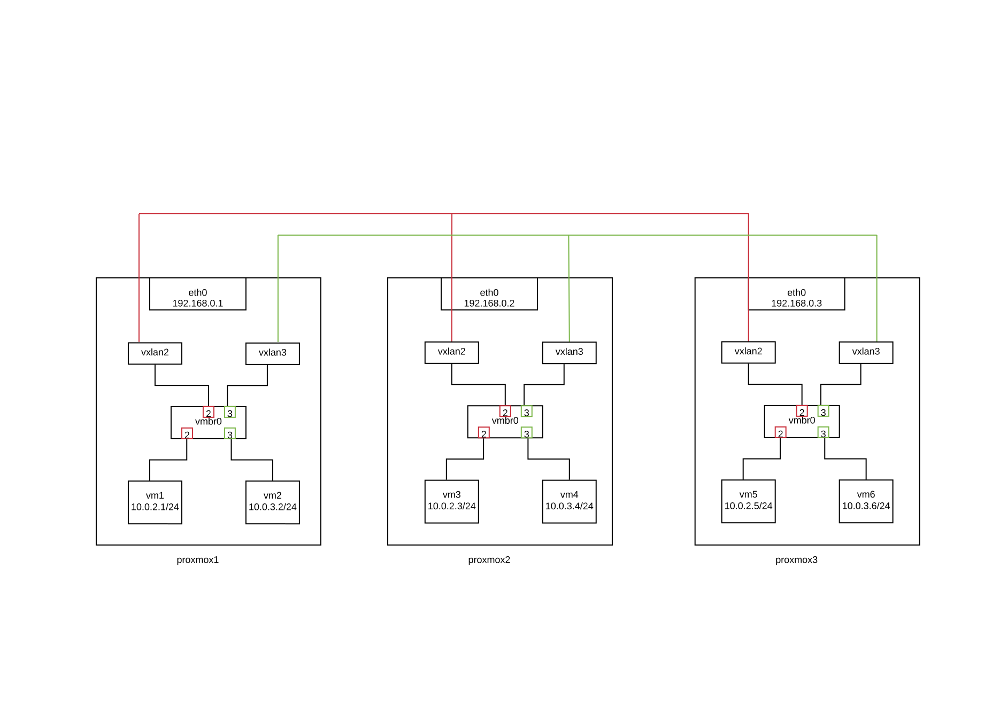

////

This is currently not included, because
- it requires ifupdown2
- routing needs more documentation

////

VXLAN layer2 with vlan unware linux bridges
~~~~~~~~~~~~~~~~~~~~~~~~~~~~~~~~~~~~~~~~~~~

VXLAN is an overlay network to carry Ethernet traffic over an existing IP network
while accommodating a very large number of tenants. It is defined in RFC 7348.
Each overlay network is known as a VXLAN Segment and identified by a unique
24-bit segment ID called a VXLAN Network Identifier (VNI).

For BUM traffic (broadcast / unknown unicast traffic, multicast),
we have 3 differents vxlan setup modes : multicast, unicast, bgp-evpn

image::images/vxlan-l2-vlanunaware.svg["vxlan l2 bridge vlan unaware",align="center"]

multicast mode
^^^^^^^^^^^^^^

This scenario relies in head end replication, meaning that end host in case
of not having any entry for the destination MAC address will send out an ARP
to other devices / VTEPs in the VXLAN network.
This is done by sending the request to the VXLAN multicast group,
remote VTEPs will get the packet and answer accordingly direct to the originating VTEP.

* node1

----
auto eno1
iface eno1 inet manual

auto vmbr0
iface vmbr0 inet static
        address 192.168.0.1
        netmask  255.255.255.0
        bridge_ports eno1
        bridge_stp off
        bridge_fd 0

auto vxlan2
iface vxlan2 inet manual
        vxlan-svcnodeip 225.20.1.1
        vxlan-physdev eno1

auto vmbr2
iface vmbr2 inet manual
        bridge_ports vxlan2
        bridge_stp off
        bridge_fd 0

auto vxlan3
iface vxlan3 inet manual
        vxlan-svcnodeip 225.20.1.1
        vxlan-physdev eno1

auto vmbr3
iface vmbr3 inet manual
        bridge_ports vxlan3
        bridge_stp off
        bridge_fd 0
----

* node2

----
auto eno1
iface eno1 inet manual

auto vmbr0
iface vmbr0 inet static
        address 192.168.0.2
        netmask  255.255.255.0
        bridge_ports eno1
        bridge_stp off
        bridge_fd 0

auto vxlan2
iface vxlan2 inet manual
        vxlan-svcnodeip 225.20.1.1
        vxlan-physdev eno1

auto vmbr2
iface vmbr2 inet manual
        bridge_ports vxlan2
        bridge_stp off
        bridge_fd 0

auto vxlan3
iface vxlan3 inet manual
        vxlan-svcnodeip 225.20.1.1
        vxlan-physdev eno1

auto vmbr3
iface vmbr3 inet manual
        bridge_ports vxlan3
        bridge_stp off
        bridge_fd 0
----

* node3

----
auto eno1
iface eno1 inet manual

auto vmbr0
iface vmbr0 inet static
        address 192.168.0.3
        netmask  255.255.255.0
        bridge_ports eno1
        bridge_stp off
        bridge_fd 0

auto vxlan2
iface vxlan2 inet manual
        vxlan-svcnodeip 225.20.1.1
        vxlan-physdev eno1

auto vmbr2
iface vmbr2 inet manual
        bridge_ports vxlan2
        bridge_stp off
        bridge_fd 0

auto vxlan3
iface vxlan3 inet manual
        vxlan-svcnodeip 225.20.1.1
        vxlan-physdev eno1

auto vmbr3
iface vmbr3 inet manual
        bridge_ports vxlan3
        bridge_stp off
        bridge_fd 0
----

unicast mode
^^^^^^^^^^^^

We can replace multicast by head-end replication of BUM frames to a statically configured lists of remote VTEPs.
The VXLAN is defined without a remote multicast group.
Instead, all the remote VTEPs are associated with the all-zero address:
a BUM frame will be duplicated to all these destinations.
The VXLAN device will still learn remote addresses automatically using source-address learning.

* node1

----
auto eno1
iface eno1 inet manual

auto vmbr0
iface vmbr0 inet static
        address 192.168.0.1
        netmask  255.255.255.0
        bridge_ports eno1
        bridge_stp off
        bridge_fd 0

auto vxlan2
iface vxlan2 inet manual
        vxlan_remoteip 192.168.0.2
        vxlan_remoteip 192.168.0.3

auto vmbr2
iface vmbr2 inet manual
        bridge_ports vxlan2
        bridge_stp off
        bridge_fd 0

auto vxlan3
iface vxlan2 inet manual
        vxlan_remoteip 192.168.0.2
        vxlan_remoteip 192.168.0.3

auto vmbr3
iface vmbr3 inet manual
        bridge_ports vxlan3
        bridge_stp off
        bridge_fd 0
----

* node2

----
auto eno1
iface eno1 inet manual

auto vmbr0
iface vmbr0 inet static
        address 192.168.0.2
        netmask  255.255.255.0
        bridge_ports eno1
        bridge_stp off
        bridge_fd 0

auto vxlan2
iface vxlan2 inet manual
        vxlan_remoteip 192.168.0.1
        vxlan_remoteip 192.168.0.3

auto vmbr2
iface vmbr2 inet manual
        bridge_ports vxlan2
        bridge_stp off
        bridge_fd 0

auto vxlan3
iface vxlan2 inet manual
        vxlan_remoteip 192.168.0.1
        vxlan_remoteip 192.168.0.3

auto vmbr3
iface vmbr3 inet manual
        bridge_ports vxlan3
        bridge_stp off
        bridge_fd 0
----

* node3

----
auto eno1
iface eno1 inet manual

auto vmbr0
iface vmbr0 inet static
        address 192.168.0.3
        netmask  255.255.255.0
        bridge_ports eno1
        bridge_stp off
        bridge_fd 0

auto vxlan2
iface vxlan2 inet manual
        vxlan_remoteip 192.168.0.2
        vxlan_remoteip 192.168.0.3

auto vmbr2
iface vmbr2 inet manual
        bridge_ports vxlan2
        bridge_stp off
        bridge_fd 0

auto vxlan3
iface vxlan2 inet manual
        vxlan_remoteip 192.168.0.2
        vxlan_remoteip 192.168.0.3

auto vmbr3
iface vmbr3 inet manual
        bridge_ports vxlan3
        bridge_stp off
        bridge_fd 0
----

bgp-evpn
^^^^^^^^

VTEPs use control plane learning/distribution via BGP for remote MAC addresses instead of data plane learning.
VTEPs have the ability to suppress ARP flooding over VXLAN tunnels.

The control plane used here is FRR, a bgp routing software.
Each node in the proxmox cluster peer with each others nodes.
For bigger networks, or multiple proxmox clusters,
it's possible to use external bgp route reflector servers.

* node1

----
auto eno1
iface eno1 inet manual

auto vmbr0
iface vmbr0 inet static
        address 192.168.0.1
        netmask 255.255.255.0
        bridge_ports eno1
        bridge_stp off
        bridge_fd 0

auto vxlan2
iface vxlan2 inet manual
        vxlan-local-tunnelip 192.168.0.1
        bridge-learning off
        bridge-arp-nd-suppress on
        bridge-unicast-flood off
        bridge-multicast-flood off

auto vmbr2
iface vmbr2 inet manual
        bridge_ports vxlan2
        bridge_stp off
        bridge_fd 0

auto vxlan3
iface vxlan3 inet manual
        vxlan-local-tunnelip 192.168.0.1
        bridge-learning off
        bridge-arp-nd-suppress on
        bridge-unicast-flood off
        bridge-multicast-flood off

auto vmbr3
iface vmbr3 inet manual
        bridge_ports vxlan3
        bridge_stp off
        bridge_fd 0
----

/etc/frr/frr.conf

----
router bgp 1234
 no bgp default ipv4-unicast
 coalesce-time 1000
 neighbor 192.168.0.2 remote-as 1234
 neighbor 192.168.0.3 remote-as 1234
 !
 address-family l2vpn evpn
  neighbor 192.168.0.2 activate
  neighbor 192.168.0.3 activate
  advertise-all-vni
 exit-address-family
!
line vty
!
----

* node2

----
auto eno1
iface eno1 inet manual

auto vmbr0
iface vmbr0 inet static
        address 192.168.0.2
        netmask 255.255.255.0
        bridge_ports eno1
        bridge_stp off
        bridge_fd 0

auto vxlan2
iface vxlan2 inet manual
        vxlan-local-tunnelip 192.168.0.2
        bridge-learning off
        bridge-arp-nd-suppress on
        bridge-unicast-flood off
        bridge-multicast-flood off

auto vmbr2
iface vmbr2 inet manual
        bridge_ports vxlan2
        bridge_stp off
        bridge_fd 0

auto vxlan3
iface vxlan3 inet manual
        vxlan-local-tunnelip 192.168.0.2
        bridge-learning off
        bridge-arp-nd-suppress on
        bridge-unicast-flood off
        bridge-multicast-flood off

auto vmbr3
iface vmbr3 inet manual
        bridge_ports vxlan3
        bridge_stp off
        bridge_fd 0
----

/etc/frr/frr.conf

----
router bgp 1234
 no bgp default ipv4-unicast
 coalesce-time 1000
 neighbor 192.168.0.1 remote-as 1234
 neighbor 192.168.0.3 remote-as 1234
 !
 address-family l2vpn evpn
  neighbor 192.168.0.1 activate
  neighbor 192.168.0.3 activate
  advertise-all-vni
 exit-address-family
!
line vty
!
----

* node3

----
auto eno1
iface eno1 inet manual

auto vmbr0
iface vmbr0 inet static
        address 192.168.0.2
        netmask 255.255.255.0
        bridge_ports eno1
        bridge_stp off
        bridge_fd 0

auto vxlan2
iface vxlan2 inet manual
        vxlan-local-tunnelip 192.168.0.3
        bridge-learning off
        bridge-arp-nd-suppress on
        bridge-unicast-flood off
        bridge-multicast-flood off

auto vmbr2
iface vmbr2 inet manual
        bridge_ports vxlan2
        bridge_stp off
        bridge_fd 0

auto vxlan3
iface vxlan3 inet manual
        vxlan-local-tunnelip 192.168.0.3
        bridge-learning off
        bridge-arp-nd-suppress on
        bridge-unicast-flood off
        bridge-multicast-flood off

auto vmbr3
iface vmbr3 inet manual
        bridge_ports vxlan3
        bridge_stp off
        bridge_fd 0
----

/etc/frr/frr.conf

----
router bgp 1234
 no bgp default ipv4-unicast
 coalesce-time 1000
 neighbor 192.168.0.1 remote-as 1234
 neighbor 192.168.0.2 remote-as 1234
 !
 address-family l2vpn evpn
  neighbor 192.168.0.1 activate
  neighbor 192.168.0.2 activate
  advertise-all-vni
 exit-address-family
!
line vty
!
----

VXLAN layer2 with vlan aware linux bridges
~~~~~~~~~~~~~~~~~~~~~~~~~~~~~~~~~~~~~~~~~~

We use 1 vmbr bridge, each vxlan is mapped to a vlan

multicast mode
^^^^^^^^^^^^^^

* node1

----
auto eno1
iface eno1 inet manual

auto vmbr0
iface vmbr0 inet static
        address 192.168.0.1
        netmask  255.255.255.0
        bridge_ports eno1 vxlan2 vxlan3
        bridge_stp off
        bridge_fd 0
        bridge_vlan_aware yes

auto vxlan2
iface vxlan2 inet manual
        vxlan-svcnodeip 225.20.1.1
        vxlan-physdev eno1
        bridge-access 2

auto vxlan3
iface vxlan3 inet manual
        vxlan-svcnodeip 225.20.1.1
        vxlan-physdev eno1
        bridge-access 3
----

* node2

----
auto eno1
iface eno1 inet manual

auto vmbr0
iface vmbr0 inet static
        address 192.168.0.2
        netmask  255.255.255.0
        bridge_ports eno1 vxlan2 vxlan3
        bridge_stp off
        bridge_fd 0
        bridge_vlan_aware yes

auto vxlan2
iface vxlan2 inet manual
        vxlan-svcnodeip 225.20.1.1
        vxlan-physdev eno1
        bridge-access 2

auto vxlan3
iface vxlan3 inet manual
        vxlan-svcnodeip 225.20.1.1
        vxlan-physdev eno1
        bridge-access 3
----

* node3

----
auto eno1
iface eno1 inet manual

auto vmbr0
iface vmbr0 inet static
        address 192.168.0.3
        netmask 255.255.255.0
        bridge_ports eno1 vxlan2 vxlan3
        bridge_stp off
        bridge_fd 0
        bridge_vlan_aware yes

auto vxlan2
iface vxlan2 inet manual
        vxlan-svcnodeip 225.20.1.1
        vxlan-physdev eno1
        bridge-access 2

auto vxlan3
iface vxlan3 inet manual
        vxlan-svcnodeip 225.20.1.1
        vxlan-physdev eno1
        bridge-access 3
----

unicast mode
^^^^^^^^^^^^

* node1

----
auto eno1
iface eno1 inet manual

auto vmbr0
iface vmbr0 inet static
        address 192.168.0.1
        netmask 255.255.255.0
        bridge_ports eno1 vxlan2 vxlan3
        bridge_stp off
        bridge_fd 0
        bridge_vlan_aware yes

auto vxlan2
iface vxlan2 inet manual
        vxlan_remoteip 192.168.0.2
        vxlan_remoteip 192.168.0.3
        bridge-access 2

auto vxlan3
iface vxlan3 inet manual
        vxlan_remoteip 192.168.0.2
        vxlan_remoteip 192.168.0.3
        bridge-access 3
----

* node2

----
auto eno1
iface eno1 inet manual

auto vmbr0
iface vmbr0 inet static
        address 192.168.0.2
        netmask 255.255.255.0
        bridge_ports eno1 vxlan2 vxlan3
        bridge_stp off
        bridge_fd 0
        bridge_vlan_aware yes

auto vxlan2
iface vxlan2 inet manual
        vxlan_remoteip 192.168.0.1
        vxlan_remoteip 192.168.0.3
        bridge-access 2

auto vxlan3
iface vxlan3 inet manual
        vxlan_remoteip 192.168.0.1
        vxlan_remoteip 192.168.0.3
        bridge-access 3
----

* node3

----
auto eno1
iface eno1 inet manual

auto vmbr0
iface vmbr0 inet static
        address 192.168.0.3
        netmask 255.255.255.0
        bridge_ports eno1 vxlan2 vxlan3
        bridge_stp off
        bridge_fd 0
        bridge_vlan_aware yes

auto vxlan2
iface vxlan2 inet manual
        vxlan_remoteip 192.168.0.2
        vxlan_remoteip 192.168.0.3
        bridge-access 2

auto vxlan3
iface vxlan3 inet manual
        vxlan_remoteip 192.168.0.2
        vxlan_remoteip 192.168.0.3
        bridge-access 3
----

bgp-evpn
^^^^^^^^

Note: currently FRR is working only with 1 vlan aware bridge

* node1

----
auto eno1
iface eno1 inet manual

auto vmbr0
iface vmbr0 inet static
        address 192.168.0.1
        netmask 255.255.255.0
        bridge_ports eno1 vxlan2 vxlan3
        bridge_stp off
        bridge_fd 0
        bridge_vlan_aware yes

auto vxlan0
iface vxlan0 inet manual
        vxlan-local-tunnelip 192.168.0.1
        bridge-learning off
        bridge-arp-nd-suppress on
        bridge-unicast-flood off
        bridge-multicast-flood off
        bridge-access 2

auto vxlan3
iface vxlan3 inet manual
        vxlan-local-tunnelip 192.168.0.1
        bridge-learning off
        bridge-arp-nd-suppress on
        bridge-unicast-flood off
        bridge-multicast-flood off
        bridge-access 3
----

/etc/frr/frr.conf

----
router bgp 1234
 no bgp default ipv4-unicast
 coalesce-time 1000
 neighbor 192.168.0.2 remote-as 1234
 neighbor 192.168.0.3 remote-as 1234
 !
 address-family l2vpn evpn
  neighbor 192.168.0.2 activate
  neighbor 192.168.0.3 activate
  advertise-all-vni
 exit-address-family
!
line vty
!
----

* node2

----
auto eno1
iface eno1 inet manual

auto vmbr0
iface vmbr0 inet static
        address 192.168.0.2
        netmask 255.255.255.0
        bridge_ports eno1 vxlan2 vxlan3
        bridge_stp off
        bridge_fd 0
        bridge_vlan_aware yes

auto vxlan0
iface vxlan0 inet manual
        vxlan-local-tunnelip 192.168.0.2
        bridge-learning off
        bridge-arp-nd-suppress on
        bridge-unicast-flood off
        bridge-multicast-flood off
        bridge-access 2

auto vxlan3
iface vxlan3 inet manual
        vxlan-local-tunnelip 192.168.0.2
        bridge-learning off
        bridge-arp-nd-suppress on
        bridge-unicast-flood off
        bridge-multicast-flood off
        bridge-access 3
----

/etc/frr/frr.conf

----
router bgp 1234
 no bgp default ipv4-unicast
 coalesce-time 1000
 neighbor 192.168.0.1 remote-as 1234
 neighbor 192.168.0.3 remote-as 1234
 !
 address-family l2vpn evpn
  neighbor 192.168.0.1 activate
  neighbor 192.168.0.3 activate
  advertise-all-vni
 exit-address-family
!
line vty
!
----

* node3

----
auto eno1
iface eno1 inet manual

auto vmbr0
iface vmbr0 inet static
        address 192.168.0.3
        netmask 255.255.255.0
        bridge_ports eno1 vxlan2 vxlan3
        bridge_stp off
        bridge_fd 0
        bridge_vlan_aware yes

auto vxlan0
iface vxlan0 inet manual
        vxlan-local-tunnelip 192.168.0.3
        bridge-learning off
        bridge-arp-nd-suppress on
        bridge-unicast-flood off
        bridge-multicast-flood off
        bridge-access 2

auto vxlan3
iface vxlan3 inet manual
        vxlan-local-tunnelip 192.168.0.3
        bridge-learning off
        bridge-arp-nd-suppress on
        bridge-unicast-flood off
        bridge-multicast-flood off
        bridge-access 3
----

/etc/frr/frr.conf
----
router bgp 1234
 no bgp default ipv4-unicast
 coalesce-time 1000
 neighbor 192.168.0.1 remote-as 1234
 neighbor 192.168.0.2 remote-as 1234
 !
 address-family l2vpn evpn
  neighbor 192.168.0.1 activate
  neighbor 192.168.0.2 activate
  advertise-all-vni
 exit-address-family
!
line vty
!
----
